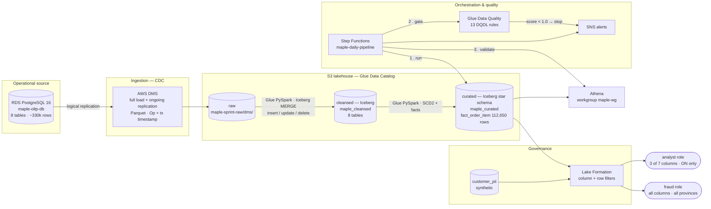
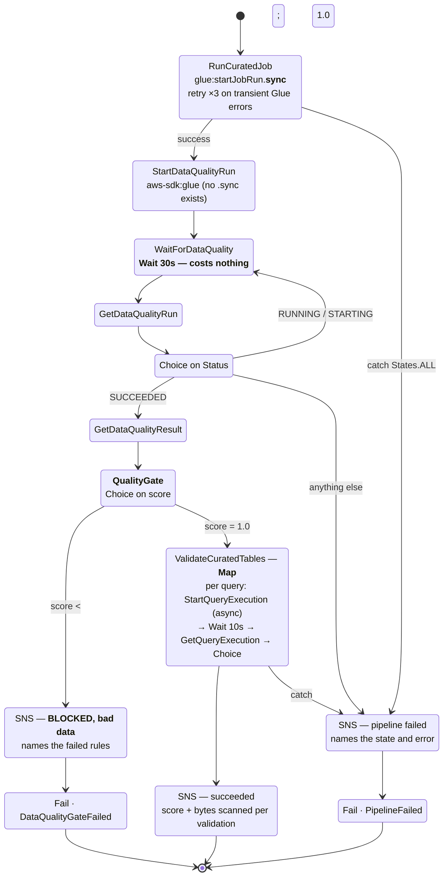
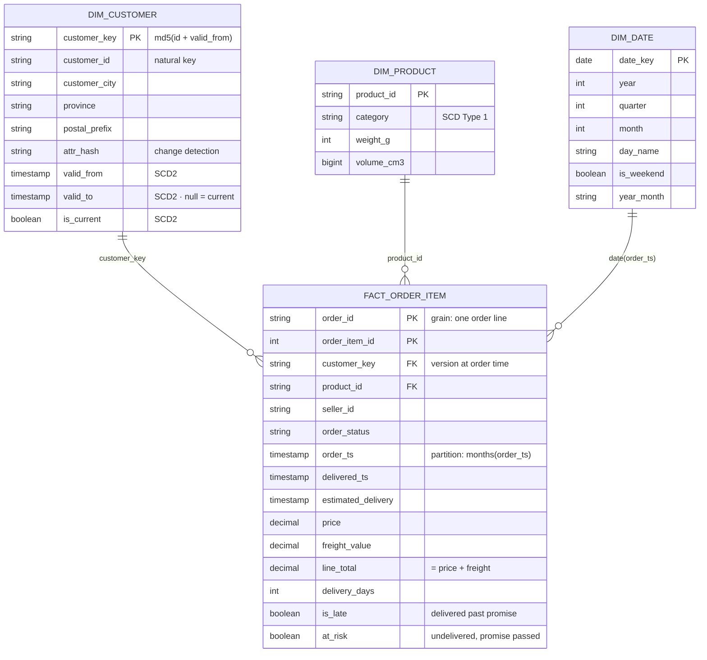

# Maple & Co. - CDC Lakehouse with Governance and Quality Gates on AWS

A working AWS data platform for a fictional Canadian retailer: <b>change data capture from an operational Postgres, landed as Apache Iceberg tables, modelled into a star schema, guarded by an automated data-quality gate, orchestrated by Step Functions, and governed by Lake Formation column- and row-level security.</b>

## The pipeline

## What it does, and what proves it

| Capability | Evidence |
|---|---|
| **CDC, not batch snapshots** | DMS runs full load then ongoing replication; every row carries `Op` (I/U/D) and a transaction timestamp, applied with an Iceberg `MERGE` that handles inserts, updates **and deletes** |
| **Open table format** | Iceberg on S3 with hidden monthly partitioning (`months(order_ts)`), row-level DML from Athena, snapshot history |
| **Dimensional model** | `fact_order_item` (112,650 rows), `dim_customer` with **SCD Type 2** validity ranges and surrogate keys, `dim_product`, `dim_date` |
| **The pipeline refuses to publish bad data** | Glue Data Quality ruleset (13 rules) evaluated as a **blocking gate** in Step Functions; a deliberately broken rule produced a red execution, an SNS alert, and **skipped downstream validation** |
| **Real orchestration** | Step Functions: `glue:startJobRun.sync` with retries, DQ polling loop, a Choice gate on quality score, and a Map running the **async Athena `StartQueryExecution` + Wait-state polling** pattern — the answer to jobs that outlive Lambda's 15-minute ceiling |
| **Governance that provably restricts** | Same query, two roles: analyst returns **3 of 7 columns and Ontario rows only**; fraud returns all 7 and every province; an explicit `SELECT email` as analyst fails with *Insufficient Lake Formation permission(s)* |
| **Audit** | CloudTrail **data** events on the PII prefix (object-level reads, not just control-plane changes) and Macie classification |

## Repository

| Path | Contents |
|---|---|
| `src/transformation/` | Glue PySpark: `raw_to_cleansed_iceberg.py` (CDC MERGE), `cleansed_to_curated.py` (SCD2 + facts), `format_benchmark.py` (Python shell, 1/16 DPU) |
| `src/ingestion/` | `seed_local_oltp.py` — seeds and exercises the OLTP source with psycopg2 |
| `src/orchestration/` | `maple_daily_pipeline.asl.json` — the state machine |
| `src/quality/` | `maple_fact_quality.dqdl` — the 13-rule ruleset |
| `generators/` | `generate_pii.py` (synthetic PII), `profile_data.py` (source profiling) |
| `scripts/` | `lakeformation_setup.py`, `assume_and_query.py`, `dq_ruleset.py`, `dashboard_data.py`, `aws_inventory.py`, `cost_report.py`, `check_replication_slots.py` |
| `sql/` | Athena analytics, partition lab, Lake Formation lab, Redshift DDL |
| `docs/sprint/` | Day-by-day build runbooks — every console setting and IAM policy, so the build is reproducible by hand |
| `docs/adr/`, `docs/spikes/` | Decisions, and services designed but not deployed |

## Orchestration and the quality gate
 

 
Two design points worth naming:
 
- **Wait states are free and unbounded.** A Lambda polling the same query would
  bill for idle time and die at 15 minutes. This is why long-running queries
  belong behind an async start plus a polling loop.
- **Bad data and broken code alert differently.** A failed quality gate is not
  a crash; it produces its own message naming the failing rules, and downstream
  consumers are deliberately left untouched.

 ## Curated data model
 

 
**Measured:** `fact_order_item` holds **112,650** rows; the composite key
`(order_id, order_item_id)` has uniqueness **1.0**; `delivered_ts` completeness
is **97.82%**; prices span **$0.85 – $6,735**.
 
**Why the fact carries `customer_key`, not `customer_id`:** the surrogate key
points at the *version of the customer that was current when the order
happened*. If a customer moves province, historical revenue stays attributed to
where they lived at the time. That is the entire purpose of SCD Type 2 — and
the reason `dim_customer` carries `valid_from` / `valid_to` / `is_current`
rather than being overwritten.

## Security posture

- No credentials in code, job parameters, or config files — **Secrets Manager**
  with IAM access roles throughout (including the DMS regional-principal trust).
- The private DMS instance reaches S3 through a **free gateway endpoint** and
  Secrets Manager through an interface endpoint; **no NAT gateway exists** in
  this account, by design.
- Lake Formation-governed roles hold **no `s3:GetObject` on the data** — S3
  credentials are vended by LF at query time, so column filters cannot be
  bypassed by reading the raw files.
- All PII is **synthetic** (seeded word lists; SIN-shaped values use the `000`
  test prefix). A portfolio project should never handle real personal data to
  prove it can protect personal data.

